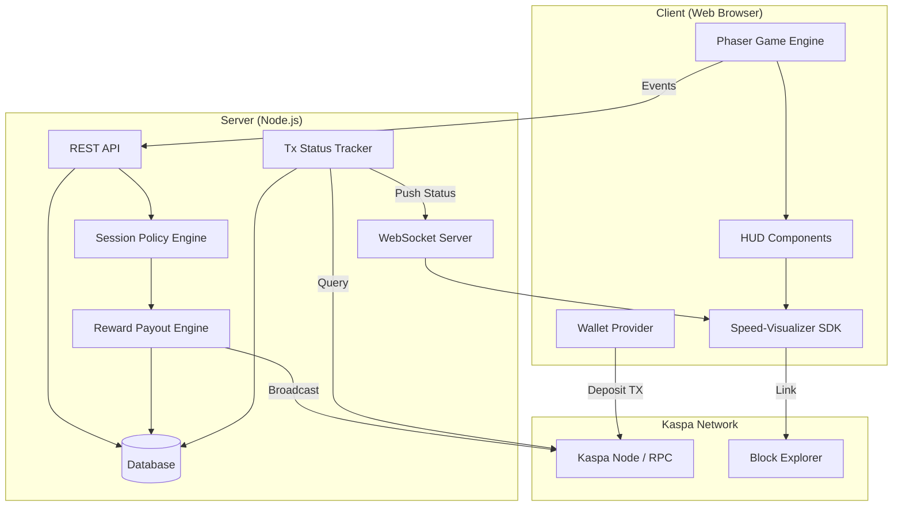
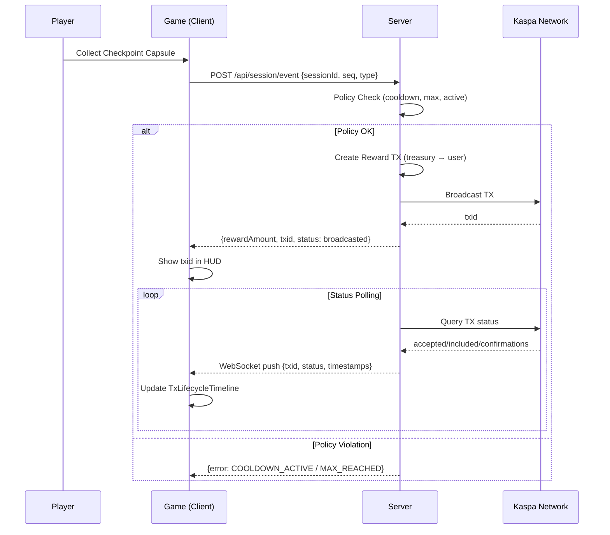
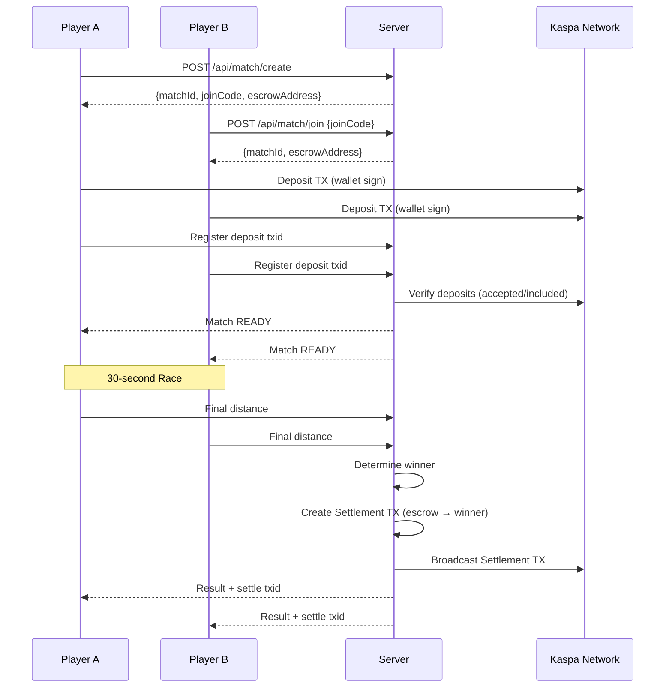

# KAS Racing — Architecture

## System Overview



## Component Breakdown

### Client (`apps/client`)

| Component | Responsibility |
|-----------|----------------|
| Phaser Game | 3-lane infinite runner, checkpoint capsules, collision |
| HUD | Distance, speed, checkpoints, tx panel |
| Wallet Provider | Abstract interface for Kasware/other wallets |
| Speed-Visualizer SDK | TxLifecycleTimeline, KaspaRPMGauge components |

### Server (`apps/server`)

| Component | Responsibility |
|-----------|----------------|
| REST API | Session start, event submission, tx status query |
| WebSocket | Real-time tx status push to clients |
| Session Policy | Cooldown (2s), max events (10), timestamp validation |
| Reward Payout | Treasury UTXO → User payout tx (1-in, 2-out) |
| Tx Status Tracker | Poll node/indexer, update state machine |
| Database | Sessions, reward_events, matches (unique: sessionId+seq) |

### SDK (`packages/speed-visualizer-sdk`)

| Component | Responsibility |
|-----------|----------------|
| TxLifecycleTimeline | broadcasted → accepted → included → confirmations |
| KaspaRPMGauge | Network pulse / estimated BPS visualization |
| NetworkPulsePanel | (Optional) Additional network stats |

## Data Flow

### Free Run: Checkpoint → Payout



### Duel: Deposit → Race → Settlement



## Transaction Types

| Type | Inputs | Outputs | Signer |
|------|--------|---------|--------|
| Reward Payout | Treasury UTXO | User (reward) + Treasury (change) | Server (treasury key) |
| Deposit | User UTXO | Escrow address | User wallet |
| Settlement | Escrow UTXO(s) | Winner (or split if draw) | Server (oracle key) |

## Key Design Decisions

1. **No Claim/Withdraw Button**: Rewards are pushed automatically on checkpoint
2. **Server-side TX Creation**: Treasury key never leaves server
3. **Idempotent Events**: (sessionId, seq) is unique; duplicate requests return existing txid
4. **Output Minimum**: 0.02 KAS minimum output to avoid dust
5. **Rate Limiting**: 2s cooldown, 10 events max per session

## Directory Structure

```
kas-racing/
├── apps/
│   ├── client/          # Phaser game + React UI
│   └── server/          # Express/Nest API + WebSocket
├── packages/
│   └── speed-visualizer-sdk/  # Reusable HUD components
├── docs/
│   ├── ARCHITECTURE.md  # This file
│   └── ...
├── PROJECT.md           # Product specification
├── TICKET.md            # Task tracking
└── WORKLOG.md           # Progress log
```

## Security Boundaries

- **Server-only secrets**: `TREASURY_PRIVATE_KEY`, `ORACLE_PRIVATE_KEY`
- **Never log**: Private keys, seeds, sensitive user data
- **Never expose**: API keys to client (indexer calls go through server)
- **Validate**: All client events against session state and policy
