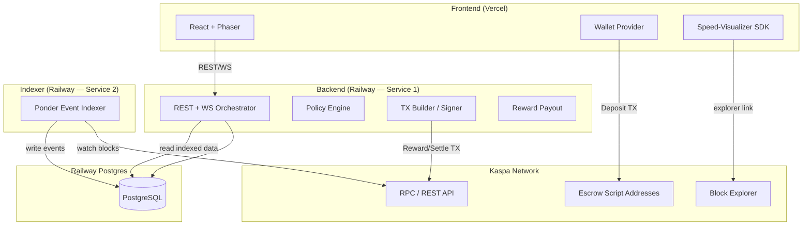
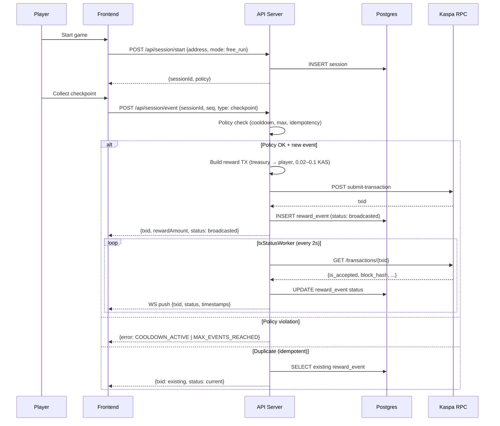
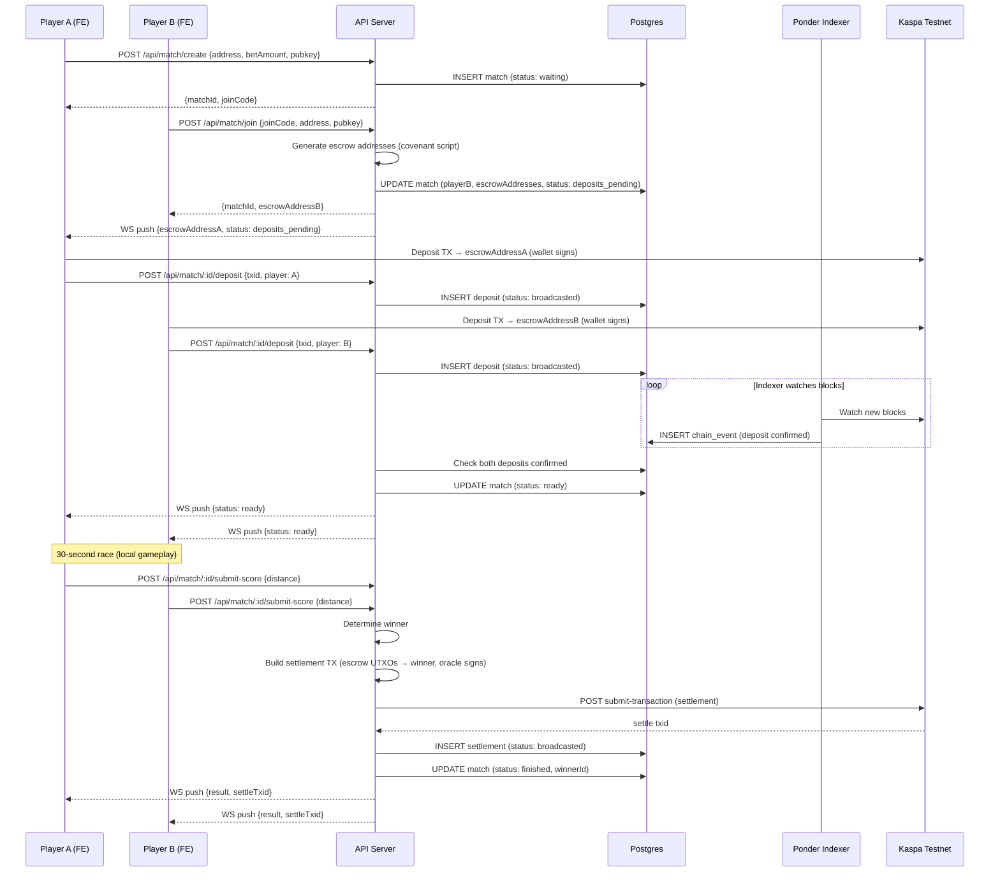
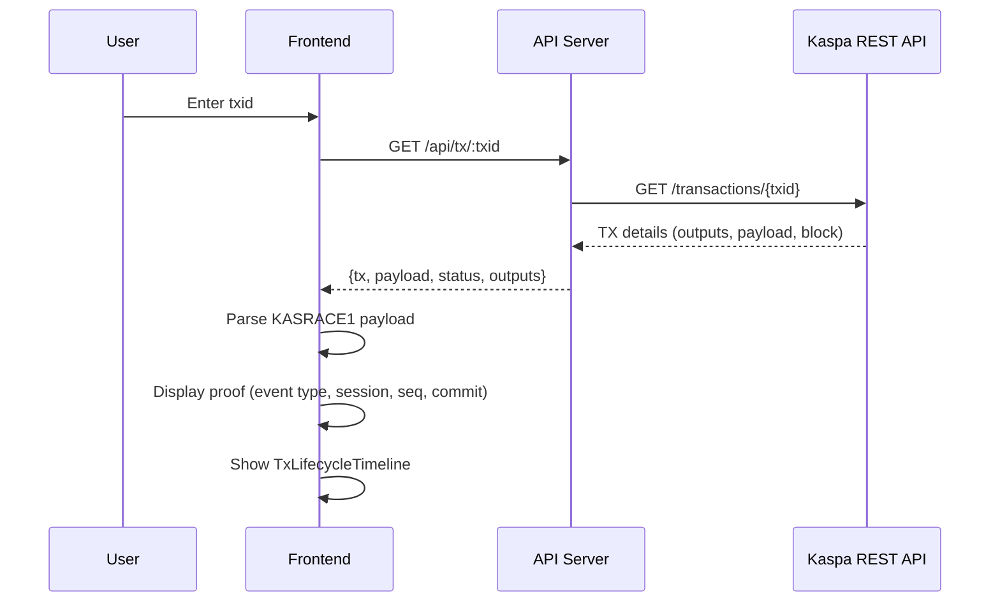
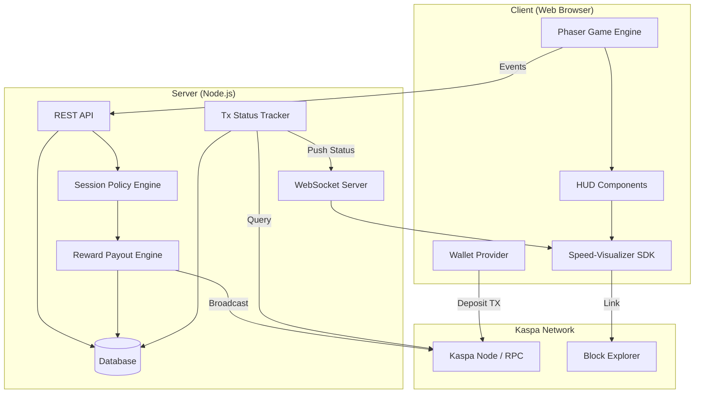
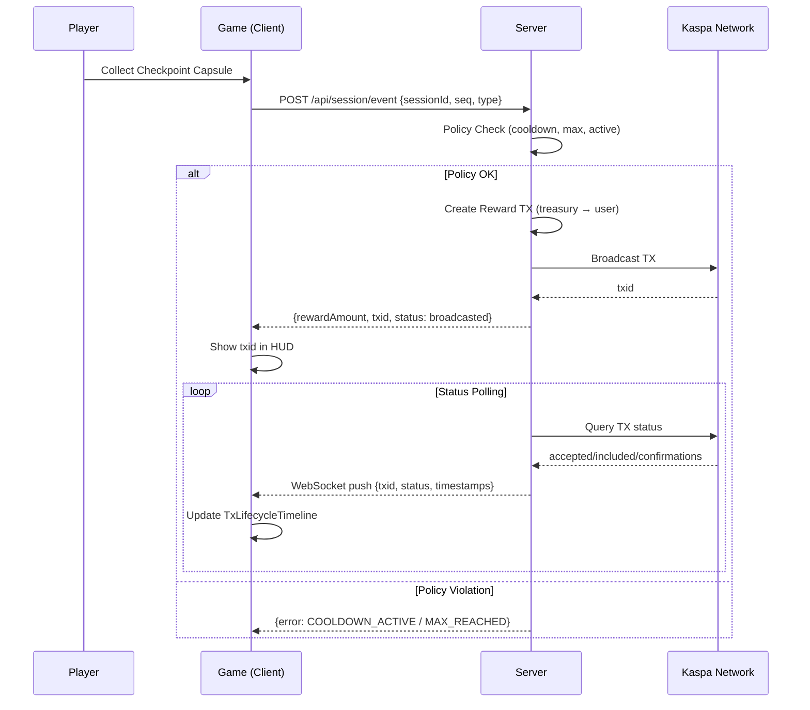
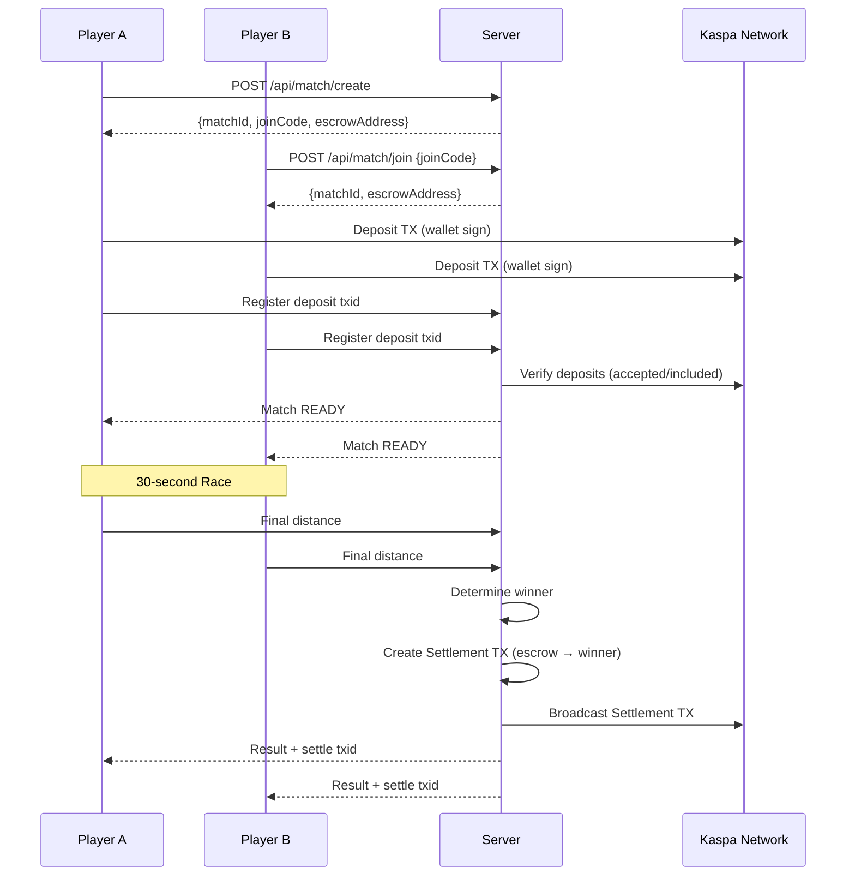

# KAS Racing — Architecture

> **ADR reference**: See [ADR-001-contract-first.md](./ADR-001-contract-first.md) for the full decision record.

---

## V2 Architecture (Contract-first) — Current Target

The sections below define the **v2 target architecture**. MVP-era diagrams are preserved at the bottom for historical reference.

### Core Principles

| # | Principle | One-liner |
|---|---|---|
| 1 | **Contract-first** | On-chain covenant escrow is the source of truth for deposits/settlements |
| 2 | **Server as Orchestrator** | Server handles keys, policy, TX orchestration — never overrides on-chain state |
| 3 | **Postgres single DB** | All operational data (matches, deposits, settlements, events, idempotency) in one Postgres |
| 4 | **Ponder for indexing** | Contract events are indexed into Postgres by Ponder; API reads indexed data |
| 5 | **Deploy split** | FE = Vercel, BE + Indexer + Postgres = Railway |

### Target Topology



### Runtime Responsibilities

| Layer | Owns | Does NOT own |
|---|---|---|
| **Frontend** | Wallet connect, game UI, TX signing (deposits), real-time status display | Key custody, policy enforcement, TX broadcasting (rewards/settlements) |
| **API Server** | Session/match lifecycle, policy checks, TX build+sign+broadcast, WS push, idempotency | On-chain rule enforcement, block indexing |
| **Ponder Indexer** | Block watching, event extraction, backfill, reorg handling, writing `chain_events` | Domain logic, TX broadcasting |
| **Postgres** | Persistent state: users, sessions, matches, deposits, settlements, chain_events, idempotency_keys | — |
| **Contract (Escrow)** | Enforce output restrictions (players only), timelock refund, oracle signature requirement | Game logic, scoring |

### Environment Matrix

| Environment | Chain Target | FE | BE | DB | Indexer | Escrow Mode |
|---|---|---|---|---|---|---|
| **local** | Testnet 12 RPC | localhost:5173 | localhost:8787 | Local Postgres | Local Ponder (optional) | covenant or fallback |
| **testnet** | Testnet 12 | Vercel preview | Railway dev | Railway Postgres | Railway Ponder | covenant |
| **staging** | Testnet 12 | Vercel preview | Railway staging | Railway Postgres | Railway Ponder | covenant |
| **production** | Mainnet | Vercel prod | Railway prod | Railway Postgres | Railway Ponder | fallback (until KIP-10 mainnet) |

### Directory Structure (v2)

```
kas-racing/
├── apps/
│   ├── client/                    # React + Phaser game
│   ├── server/                    # Express REST/WS + TX engine
│   └── contracts/                 # (NEW) Contract workspace — scripts, tests, deploy
│       ├── src/                   #   Script templates + builder
│       ├── test/                  #   Contract-level tests
│       ├── deployments/           #   Per-network deploy artifacts (JSON)
│       └── scripts/               #   Deploy/verify scripts
├── packages/
│   └── speed-visualizer-sdk/      # Reusable HUD components
├── docs/
│   ├── ARCHITECTURE.md            # This file
│   ├── ADR-001-contract-first.md  # Architecture decision record
│   └── ...
├── deploy/                        # Deploy templates + smoke test
├── PROJECT.md
├── TICKET.md
└── WORKLOG.md
```

### Postgres Schema v2 (Target)

| Table | Purpose | Key Columns |
|---|---|---|
| `users` | Player accounts | id, address, createdAt |
| `sessions` | Game sessions | id, userId, mode, status, policy snapshot, eventCount |
| `reward_events` | Reward TX tracking | id, sessionId, seq (unique pair), txid, txStatus, lifecycle timestamps |
| `matches` | Duel matches | id, joinCode, players, betAmount, status, escrowMode, scores |
| `contracts` | **(NEW)** Deployed contract addresses | id, network, type, address, deployTxid, deployedAt |
| `deposits` | **(NEW)** Deposit TX tracking (split from matches) | id, matchId, player, txid, status, amount, confirmedAt |
| `settlements` | **(NEW)** Settlement TX tracking (split from matches) | id, matchId, txid, status, mode, winnerAddress, amount |
| `chain_events` | **(NEW)** Raw indexed events from Ponder | id, blockNumber, txid, eventType, data, indexedAt |
| `idempotency_keys` | **(NEW)** Request deduplication | key, response, expiresAt |

> Current schema (v1) stores deposit/settlement fields inline on the `matches` table. v2 promotes them to separate tables for indexer compatibility and query flexibility.

---

### Data Flow — Free Run (v2)

Free Run does **not** use contracts. The server builds and broadcasts reward TXs from the treasury.



### Data Flow — Duel (v2, Covenant Mode)



### Data Flow — Duel (Fallback Mode, Mainnet)

When covenants are not available (mainnet), the flow differs at deposit and settlement:

1. **Deposit**: Players send to the **treasury address** (server-custodial).
2. **Settlement**: Server pays winner from treasury (same as reward payout).
3. **Escrow mode** field in DB is set to `fallback`.

The API transparently selects the mode based on the `NETWORK` env var.

### Data Flow — Proof Page



### Service Boundaries

```
┌─────────────────────────────────────────────────────────────┐
│                        FRONTEND                              │
│  Wallet connect │ Game scenes │ HUD/SDK │ API client         │
│  ─ ─ ─ ─ ─ ─ ─ ─ ─ ─ ─ ─ ─ ─ ─ ─ ─ ─ ─ ─ ─ ─ ─ ─ ─ ─   │
│  Boundary: Never holds private keys. Never calls RPC direct. │
└──────────────────────────┬──────────────────────────────────┘
                           │ REST / WebSocket
┌──────────────────────────▼──────────────────────────────────┐
│                       API SERVER                             │
│  Routes │ Policy │ TX Engine │ Reward │ Settlement │ Workers │
│  ─ ─ ─ ─ ─ ─ ─ ─ ─ ─ ─ ─ ─ ─ ─ ─ ─ ─ ─ ─ ─ ─ ─ ─ ─ ─   │
│  Boundary: Holds treasury+oracle keys. Builds/signs/         │
│  broadcasts TXs. Reads Postgres. Never exposes keys to FE.  │
└───────────┬───────────────────────┬─────────────────────────┘
            │ SQL                    │ RPC
┌───────────▼──────────┐  ┌────────▼─────────────────────────┐
│     POSTGRES          │  │        KASPA NETWORK              │
│  Single source of     │  │  Testnet 12 or Mainnet            │
│  operational truth    │  │  Escrow scripts (P2SH addresses)  │
└───────────▲──────────┘  └────────▲─────────────────────────┘
            │ SQL                    │ RPC (watch blocks)
┌───────────┴──────────────────────┴─────────────────────────┐
│                    PONDER INDEXER                            │
│  Block watcher │ Event extractor │ Backfill │ Reorg handler │
│  ─ ─ ─ ─ ─ ─ ─ ─ ─ ─ ─ ─ ─ ─ ─ ─ ─ ─ ─ ─ ─ ─ ─ ─ ─ ─   │
│  Boundary: Read-only from chain. Write-only to Postgres.    │
│  No domain logic. No TX broadcasting.                       │
└─────────────────────────────────────────────────────────────┘
```

### Contract Interaction Details

**Escrow Script** (Kaspa KIP-10 covenant, P2SH):

```
Branch A — Oracle Settlement:
  <oracle_pubkey> OP_CHECKSIG
  OP_VERIFY
  OP_TXOUTPUTCOUNT
  <2> OP_NUMEQUALVERIFY          // exactly 2 outputs
  <0> OP_TXOUTPUTSCRIPTPUBKEY
  <playerA_script> OP_EQUAL      // output 0 must go to player A or B
  ... (output restriction logic)

Branch B — Timelock Refund:
  <locktime> OP_CHECKLOCKTIMEVERIFY
  OP_DROP
  <depositor_pubkey> OP_CHECKSIG  // original depositor can reclaim
```

See [ESCROW_SCRIPT_TEMPLATE.md](./ESCROW_SCRIPT_TEMPLATE.md) for the full template.

**Address Generation**: Per match, per player — 2 unique P2SH addresses per duel.

**Settlement TX Structure**:
- Inputs: escrow UTXO(s) from both players' escrow addresses
- Outputs: winner address (win) or both addresses (draw)
- Signer: oracle key (satisfies Branch A)

### Transaction Types (v2)

| Type | Inputs | Outputs | Signer | Contract? |
|---|---|---|---|---|
| Reward Payout | Treasury UTXO | User (reward) + Treasury (change) | Server (treasury key) | No |
| Deposit | User UTXO | Escrow P2SH address | User wallet | Yes (testnet) |
| Settlement | Escrow UTXO(s) | Winner (or split if draw) | Server (oracle key) | Yes (testnet) |
| Refund | Escrow UTXO | Original depositor | Depositor (after timelock) | Yes (testnet) |

### Failure Modes + Fallbacks

| Failure | Detection | Fallback |
|---|---|---|
| Testnet RPC down | Health check fails / TX broadcast timeout | Switch to fallback mode (treasury custodial) |
| Ponder indexer behind | API detects stale `chain_events` | Direct RPC query for deposit status |
| Postgres down | Connection pool error | Server returns 503; FE shows "service unavailable" |
| Covenant TX rejected | Broadcast returns error | Log error; retry once; if still fails, mark settlement as `failed` |
| Player wallet refuses | FE catches rejection | Show retry button + error message |

### Security Boundaries (v2)

| Boundary | Rule |
|---|---|
| Private keys | Treasury + Oracle keys exist only in API server process memory |
| Logging | Never log private keys, seeds, or full addresses (truncate to first/last 4 chars) |
| Client exposure | FE never calls Kaspa RPC directly; all chain reads go through API |
| CORS | `CORS_ORIGIN` restricts to known FE domains |
| Rate limiting | Per-IP limits on session events (30/min), match operations (20/min), general API (100/min) |
| Idempotency | `(sessionId, seq)` unique for rewards; `idempotency_keys` table for general dedup |

---

## Legacy MVP Architecture (v1 Reference)

> The sections below document the original MVP architecture (P0–P12). Retained for historical reference.

### System Overview



## Component Breakdown

### Client (`apps/client`)

| Component | Responsibility |
|-----------|----------------|
| Phaser Game | 3-lane infinite runner, checkpoint capsules, collision |
| HUD | Distance, speed, checkpoints, tx panel |
| Wallet Provider | Abstract interface for Kasware/other wallets |
| Speed-Visualizer SDK | TxLifecycleTimeline, KaspaRPMGauge components |

### Server (`apps/server`)

| Component | Responsibility |
|-----------|----------------|
| REST API | Session start, event submission, tx status query |
| WebSocket | Real-time tx status push to clients |
| Session Policy | Cooldown (2s), max events (10), timestamp validation |
| Reward Payout | Treasury UTXO → User payout tx (1-in, 2-out) |
| Tx Status Tracker | Poll node/indexer, update state machine |
| Database | Sessions, reward_events, matches (unique: sessionId+seq) |

### SDK (`packages/speed-visualizer-sdk`)

| Component | Responsibility |
|-----------|----------------|
| TxLifecycleTimeline | broadcasted → accepted → included → confirmations |
| KaspaRPMGauge | Network pulse / estimated BPS visualization |
| NetworkPulsePanel | (Optional) Additional network stats |

## Data Flow

### Free Run: Checkpoint → Payout



### Duel: Deposit → Race → Settlement



## Transaction Types

| Type | Inputs | Outputs | Signer |
|------|--------|---------|--------|
| Reward Payout | Treasury UTXO | User (reward) + Treasury (change) | Server (treasury key) |
| Deposit | User UTXO | Escrow address | User wallet |
| Settlement | Escrow UTXO(s) | Winner (or split if draw) | Server (oracle key) |

## Key Design Decisions

1. **No Claim/Withdraw Button**: Rewards are pushed automatically on checkpoint
2. **Server-side TX Creation**: Treasury key never leaves server
3. **Idempotent Events**: (sessionId, seq) is unique; duplicate requests return existing txid
4. **Output Minimum**: 0.02 KAS minimum output to avoid dust
5. **Rate Limiting**: 2s cooldown, 10 events max per session

## Directory Structure

```
kas-racing/
├── apps/
│   ├── client/          # Phaser game + React UI
│   └── server/          # Express/Nest API + WebSocket
├── packages/
│   └── speed-visualizer-sdk/  # Reusable HUD components
├── docs/
│   ├── ARCHITECTURE.md  # This file
│   └── ...
├── PROJECT.md           # Product specification
├── TICKET.md            # Task tracking
└── WORKLOG.md           # Progress log
```

## Security Boundaries

- **Server-only secrets**: `TREASURY_PRIVATE_KEY`, `ORACLE_PRIVATE_KEY`
- **Never log**: Private keys, seeds, sensitive user data
- **Never expose**: API keys to client (indexer calls go through server)
- **Validate**: All client events against session state and policy
